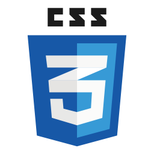

⭐ Introduction
The Placement Cell Application is a Full Stack Application built using MongoDB, ExpressJS, NodeJS, EJS, Express Partials-Layouts, Vanilla JS & implements CRUD Operations. 

This project is basically used for the purpose of assigning students to the interview slots of the incoming companies for the visit, at the backend for the employees to work. It manages both student & interview information along with the company visits. This website is only restricted for the use of employees.

Employee can create an account or signup. Employee can login using the credentials.

Employee can create students in the student's section using the form.

Employee can create companies that are visiting in the interviews's section using the form.

Student's List contains students with the student data.

Company's List contains companies with the list of students in the assigned interview slots along with the results.

Employee can add empty interview slots in a company, assign students to the interview slots along with the results.

The CSV Parser converts JSON to CSV File format & downloads the student report with all the details into your system.

🔨 Tools Used

Library:version :-
"bcryptjs": "^2.4.3",
"body-parser": "^1.20.2",
"connect-flash": "^0.1.1",
"connect-mongo": "^5.0.0",
"ejs": "^3.1.9",
"express": "^4.18.2",
"express-ejs-layouts": "^2.5.1",
"express-session": "^1.17.3",
"json2csv": "^6.0.0-alpha.2",
"moment": "^2.29.4",
"mongoose": "^7.1.1",
"nodemon": "^2.0.22",
"passport": "^0.6.0",
"passport-local": "^1.0.0"

Framework: ExpressJS
Database: MongoDB
Version Control System: Git
VCS Hosting: GitHub

Programming / Scripting: Vanilla JavaScript
Front-End: CSS, EJS
Runtime Environment: NodeJS
Integrated Development Environment: VSCode